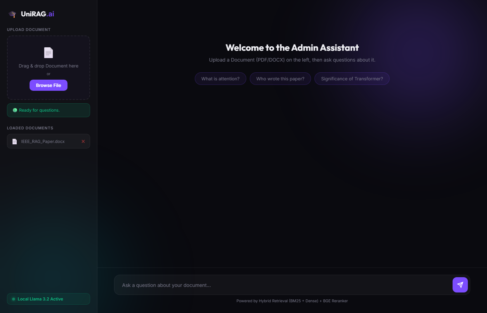

# LLM-Based RAG Q&A System

A fully local Retrieval-Augmented Generation (RAG) question-answering system built with FastAPI, ChromaDB, and Ollama. Upload PDF/DOCX documents and ask questions — answers are grounded in your documents with citation validation.

---

## Demo



---

## Features

- **Hybrid Retrieval** — BM25 sparse + dense (SBERT) retrieval combined for best recall
- **BGE Reranker** — cross-encoder reranking for high-precision top-k selection
- **Local LLM** — runs on Ollama (Llama 3.2 3B) — no API keys required
- **Streaming & Sync** — supports both SSE streaming and synchronous query modes
- **Document Management** — upload, list, and delete PDFs/DOCX via UI or API
- **Citation Validation** — post-generation hallucination detection on source citations
- **Web UI** — clean chat interface with drag-and-drop upload

---

## Tech Stack

| Component | Technology |
|---|---|
| LLM | Ollama — `llama3.2:3b` |
| Embeddings | `sentence-transformers/all-MiniLM-L6-v2` |
| Vector Store | ChromaDB (HNSW index) |
| Sparse Retrieval | BM25 (`rank-bm25`) |
| Reranker | `BAAI/bge-reranker-base` |
| API Server | FastAPI + Uvicorn |
| Frontend | Vanilla HTML / CSS / JS |

---

## Project Structure

```
LLM-Based_Q&A/
├── src/
│   ├── api/              # FastAPI app & endpoints
│   ├── ingestion/        # PDF/DOCX loader, chunker, embedder
│   ├── retrieval/        # BM25, dense, hybrid retriever, reranker
│   ├── generation/       # LLM backend, prompt builder, citation validator
│   ├── pipeline/         # RAG chain orchestration
│   ├── evaluation/       # RAGAS eval, dataset generator
│   └── observability/    # Loguru logger
├── frontend/             # Web UI (index.html, app.js, style.css)
├── configs/
│   └── settings.yaml     # All model & path configs
├── data/
│   └── raw_pdfs/         # Drop your PDFs here
├── vectorstore/          # ChromaDB persisted index (auto-created)
├── requirements.txt
└── setup_env.bat
```

---

## Setup

### Prerequisites

- Python 3.10+
- [Ollama](https://ollama.com) installed and running
- CUDA GPU recommended (RTX 3050 6GB+ tested)

### 1. Clone & install dependencies

```bash
git clone https://github.com/Ojhaji0/LLM-Based-QA.git
cd LLM-Based-QA

python -m venv .venv
.venv\Scripts\activate        # Windows
pip install -r requirements.txt
```

### 2. Pull the LLM model

```bash
ollama pull llama3.2:3b
```

### 3. Configure paths (optional)

Edit `configs/settings.yaml` to change the LLM model, embedding device, chunk size, or retrieval settings.

### 4. Start the server

```bash
python -m uvicorn src.api.main:app --host 0.0.0.0 --port 8000
```

Open your browser at **http://localhost:8000**

---

## API Endpoints

| Method | Route | Description |
|---|---|---|
| `GET` | `/health` | Server & pipeline status |
| `GET` | `/documents` | List uploaded documents |
| `POST` | `/upload` | Upload a PDF or DOCX |
| `DELETE` | `/documents/{filename}` | Delete a document |
| `GET` | `/status` | Indexing status |
| `POST` | `/query` | Ask a question (sync or streaming) |

### Example query

```bash
curl -X POST http://localhost:8000/query \
  -H "Content-Type: application/json" \
  -d '{"question": "What is system design?", "stream": false}'
```

---

## Configuration

All settings are in `configs/settings.yaml`:

```yaml
llm:
  backend: "ollama"
  model: "llama3.2:3b"
  temperature: 0.1

retrieval:
  k_dense: 20
  k_sparse: 20
  k_rerank: 5
  use_hybrid: true
  use_reranker: true

reranker:
  model: "BAAI/bge-reranker-base"
  device: "cpu"
```

---

## Hardware Requirements

| Component | Minimum |
|---|---|
| GPU VRAM | 4 GB (LLM via Ollama) |
| RAM | 8 GB |
| Storage | 5 GB (models + index) |

Tested on: RTX 3050 6GB + 16 GB RAM
